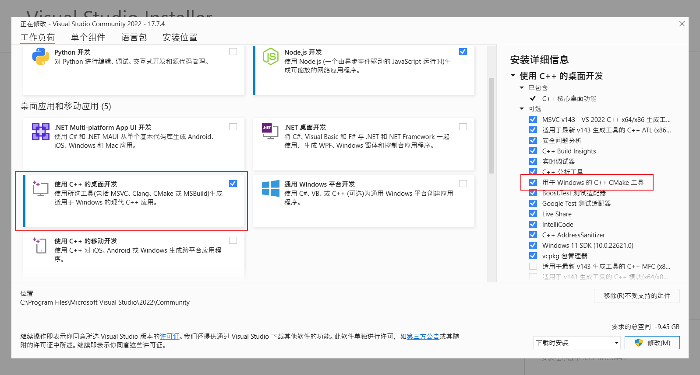

## VS2022

### Visual Studio简介

Visual Studio是一个集成开发环境（IDE），提供了MSVC编译器、调试器、代码编辑器等功能，是Windows下最强大的C++开发工具之一。

VS的优势在于更加友好的报错信息和最为强大的调试功能，是Windows下C++开发的首选工具之一。

### 下载和安装

官网[下载 Visual Studio](https://visualstudio.microsoft.com/zh-hans/downloads/)，选择社区版免费下载。

在Visual Studio Installer 界面中的**桌面和移动应用**栏中选择**使用C++的桌面开发**，在旁边安装详细信息栏中确保**用于 Windows的C++ CMake工具**已勾选，然后安装（若有需求注意调整安装位置）。

### 指定版本的VS下载

见[Visual Studio历史版本下载](https://learn.microsoft.com/en-us/visualstudio/releases/2022/release-history#updating-your-installation-to-a-specific-release)。