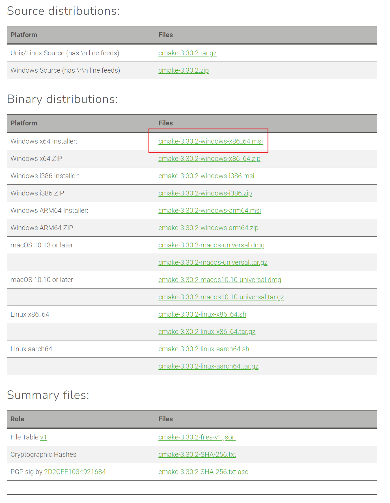
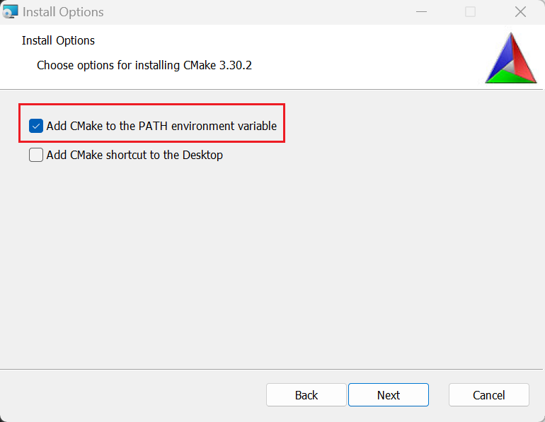
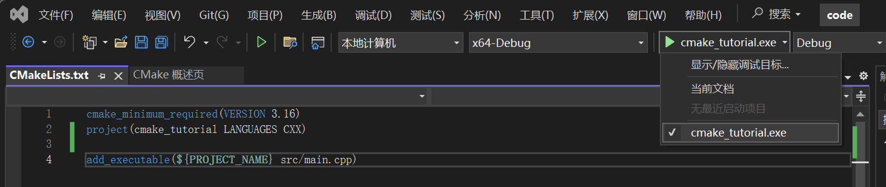

## CMake

本节将从一个简单的例子入手，带领大家了解CMake的基本用法，并一步步构建一个项目。

### 什么是CMake

CMake 是个一个开源的跨平台自动化建构系统，用来管理软件建置的程序，并不依赖于某特定编译器，并可支持多层目录、多个应用程序与多个函数库。

CMake 通过使用简单的配置文件 CMakeLists.txt，自动生成不同平台的构建文件（如 Makefile、Ninja 构建文件、Visual Studio 工程文件等），简化了项目的编译和构建过程。

CMake 本身不是构建工具，而是生成构建系统的工具，它生成的构建系统可以使用不同的编译器和工具链。

### 安装CMake

> 使用VS2022的同学理论上可以跳过这一步。

我们使用Windows下的二进制安装，打开[官网下载地址](https://cmake.org/download/)，选择`Windows x64 Installer`下载。



注意选中加入环境变量的选项。



### 工程初始化

首先创建一个文件夹，例如`cmake_tutorial`，在文件夹中创建一个`src`的文件夹，在`src`文件夹下新建一个`main.cpp`文件。

> 注意不要在任何路径中包含中文字符，养成良好的编程习惯。

> 你可以在VS2022中创建一个空项目，然后创建一个`main.cpp`文件；或者直接在文件夹中新建文本文档，然后重命名将其后缀改为`.cpp`。

打开`main.cpp`，输入以下内容：

```cpp
#include <iostream>

int main() {
    std::cout << "Hello, World!" << std::endl;
    return 0;
}
```

> 对于习惯C语言的你，里面的一些语法可能有些陌生，但是不用担心，我们会在后续的章节中详细讲解。

现在我们的文件目录结构如下：

```
cmake_tutorial
└── src
    └── main.cpp
```

我们新建一个`CMakeLists.txt`文件，输入以下内容：

```cmake
cmake_minimum_required(VERSION 3.16)
project(cmake_tutorial LANGUAGES CXX)
```

这两行是CMake的基本语法，第一行指定了CMake的最低版本，第二行指定了项目的名称和语言。`CXX`表示使用C++语言，`XX`是因为一些历史原因。其中`cmake_tutorial`是项目的名称，你可以根据自己的项目名称进行修改。

然后我们需要告诉CMake如何编译我们的项目，我们在`CMakeLists.txt`中添加以下内容：

```cmake
add_executable(${PROJECT_NAME} src/main.cpp)
```

这一行告诉CMake生成一个可执行文件，可执行文件的名称为`${PROJECT_NAME}`，源文件为`src/main.cpp`。`${xxx}`表示CMake的变量，`${PROJECT_NAME}`是CMake自动生成的变量，是我们在`project()`中设定的项的名称。

然后在VS2022中打开`cmake_tutorial`文件夹，选择合适的启动项，点击运行。



### 更复杂的项目

接下来我们将项目进行扩展，添加一个`math`文件夹，然后在`math`文件夹下新建一个`add.h`和`add.cpp`文件。

> 在新建文件过程中VS会提供一些建议，我们目前可以忽略。

`add.h`：

```cpp
#ifndef __ADD_H__
#define __ADD_H__

int add(int a, int b);
float addf(float a, float b);

#endif // __ADD_H__
```

> 这里`#ifndef`、`#define`、`#endif`是为了防止头文件被重复包含，也可以在头文件顶部使用`#pragma once`（不是C++标准，但是大多数编译器都支持）。

`add.cpp`：

```cpp
#include "add.h"

int add(int a, int b) {
    return a + b;
}

float addf(float a, float b) {
    return a + b;
}
```

现在我们的文件目录结构如下：

```
cmake_tutorial
└── src
    ├── math
    │   ├── add.h
    │   └── add.cpp
    └── main.cpp
```

接下来我们继续配置CMake，在`CMakeLists.txt`前两行后添加：

```cmake
set(CMAKE_CXX_STANDARD 17)
set(CMAKE_CXX_STANDARD_REQUIRED ON)
```

这两行告诉CMake使用C++17标准，并且强制使用这个标准。

然后修改和添加以下内容：

```cmake
set(SRC "${PROJECT_SOURCE_DIR}/src/")

file(GLOB_RECURSE PRJ_SRC "${SRC}*.cpp")

add_executable(${PROJECT_NAME} 
    ${PRJ_SRC}
)

include_directories(${PROJECT_NAME} PRIVATE 
    ${SRC}
)
```

`set(SRC "${PROJECT_SOURCE_DIR}/src/")`定义了一个变量`SRC`，表示源文件的路径。其中`${PROJECT_SOURCE_DIR}`是CMake自动生成的变量，表示项目的根目录。

`file(GLOB_RECURSE PRJ_SRC "${SRC}*.cpp")`定义了一个变量`PRJ_SRC`，表示项目中所有的`.cpp`文件。`GLOB_RECURSE`表示递归搜索，`*`表示任意字符，`*.cpp`会匹配所有的`.cpp`文件。

`add_executable(${PROJECT_NAME} ${PRJ_SRC})`告诉CMake生成一个可执行文件，可执行文件的名称为`${PROJECT_NAME}`，源文件为`PRJ_SRC`。

`include_directories(${PROJECT_NAME} PRIVATE ${SRC})`告诉CMake在编译时包含`SRC`目录，在`add.h`中使用`#include "add.h"`时，CMake会在`SRC`目录中查找。

最后我们在`main.cpp`中测试我们的修改：

```cpp
#include <iostream>
#include "math/add.h"

int main() {
    std::cout << add(1, 2) << std::endl;
    return 0;
}
```

然后在重新运行项目，你会看到输出`3`。

> 如果出现错误，可以尝试重新生成CMake缓存。（右键CMakeLists.txt -> 删除缓存并重新配置）

至此，在当前的项目上进行一些拓展，你已经可以使用CMake来构建一个简单的项目了。

### CMake进阶

参考[官方文档](https://cmake.org/cmake/help/latest/guide/tutorial/index.html)，也可以在网络上搜索一些中文的教程。