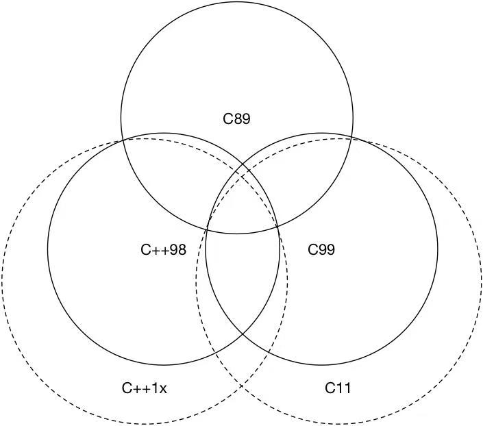

## 从C到C++

很多同学会认为C++就是C语言的一个超集，或者是"C with classes"。但实际上，C++和C是两种不同的语言。C++是在C语言的基础上发展而来的，它保留了C语言的大部分特性，同时引入了面向对象编程、模板等新特性。C++的设计目标是提供一种更好的编程方式，同时尽可能保持和C语言的兼容性。

> 事实上，现在的C语言也已经和早期的ANSI C有了很大的不同，并逐渐向现代C++靠拢。

在本章，将从C++与C的区别入手，逐渐介绍C++的一些关键特性。